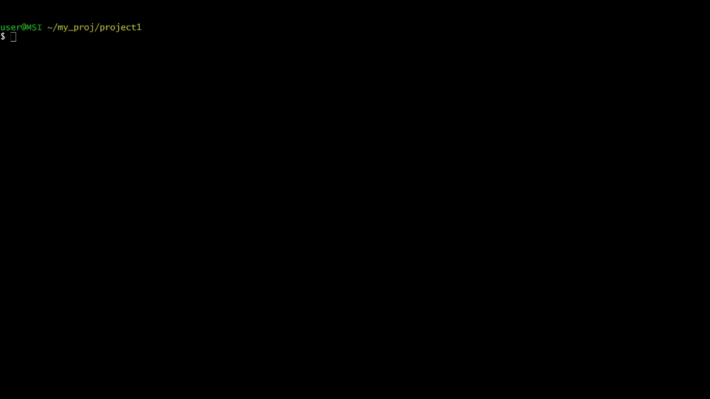

# Minesweeper
My Minesweeper game for practicing C++

## How to play

* Press d to dig current position
* Press f to put flag
* Press h to get hint
* Press shift + : to enter other command

## Gameplay demo

## Command

Press shift + : to pause the game and enable command line
* Enter help to get some help
* Enter quit to continue the game
* Enter exit to exit the game
* Enter renew to create a new game
* Enter die to disable/enable bomb
* Enter more hint to get more hint
* Enter This is too hard to win the game

## Command demo

